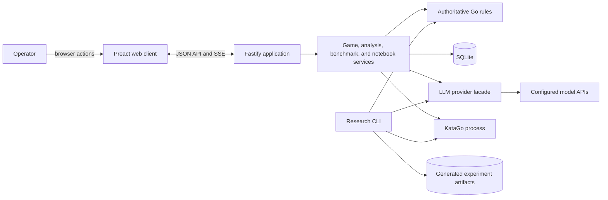
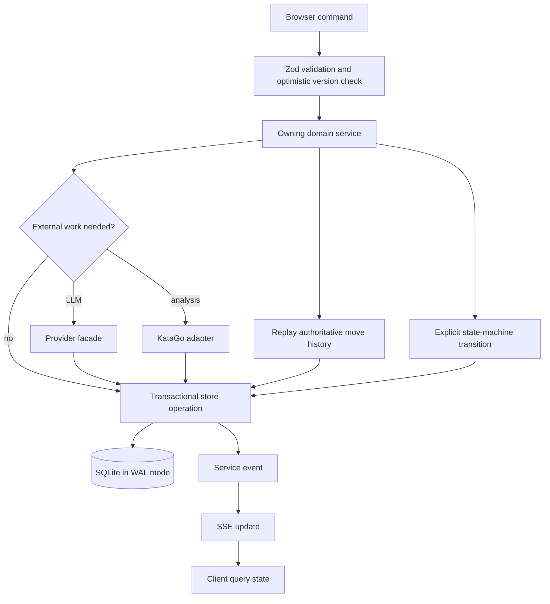
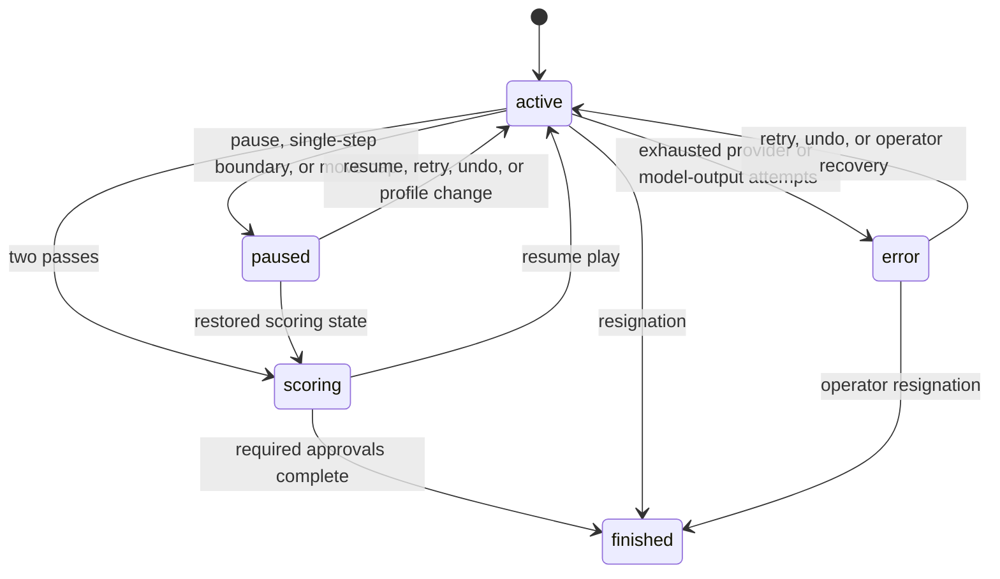
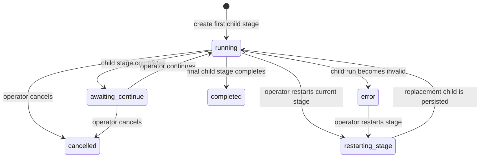

# Architecture

Verified against the implementation on 2026-09-23. This document describes the
current system; completed historical changes belong in `docs/iteration.md`.

## Purpose

LingGo is a bilingual, localhost Go workspace for human, language-model, and
KataGo-controlled play. It supports ordinary games, position analysis,
life-and-death practice, staged training benchmarks with persistent technique
notebooks, and reproducible headless research runs. The server owns all game
rules and persisted workflow transitions; the browser presents state and sends
validated commands.

## System Context

During development Vite serves the client and proxies `/api`; production uses
Fastify to serve the built client and API from one local process. Remote model
providers are optional. KataGo is an external local process, with a
deterministic substitute used by tests.

## Component Responsibilities

| Component                 | Responsibility                                                                                                                                                            |
| ------------------------- | ------------------------------------------------------------------------------------------------------------------------------------------------------------------------- |
| Web client                | Routes among games, life-and-death, benchmarks, notebooks, and settings; keeps only UI preferences and tab-scoped provider keys locally; follows server changes over SSE. |
| Fastify API               | Validates request bodies, maps HTTP errors, exposes downloads and SSE streams, and composes the domain services. It does not decide Go legality.                          |
| Game service              | Applies versioned user commands, schedules model turns, coordinates LLM conversation context, and persists accepted moves.                                                |
| Go rules                  | Replays the full move history and is authoritative for board state, turn, captures, suicide, repetition, scoring, and snapshots.                                          |
| Provider facade           | Routes generative providers and TypeSafe Jev through capability-aware action or text interfaces, with normalized usage, retry classification, and in-memory secrets.      |
| Analysis service          | Queues KataGo work, stores turn-aligned results separately from games, and publishes progress without changing game versions.                                             |
| Benchmark service         | Runs notebook initialization, problem gates, training games, review, notebook updates, and isolated final evaluation through explicit lifecycle states.                   |
| Benchmark session service | Sequences child benchmark stages, snapshots notebooks at stage boundaries, and makes continuation or restart an explicit operator action.                                 |
| Store                     | Applies ordered migrations and provides transactional SQLite persistence for domain state.                                                                                |
| Research tools            | Execute manifest-defined headless experiments, cache responses, write provenance artifacts, and calculate deterministic summaries outside the interactive database.       |

## Data Flow and Storage

SQLite is the interactive system of record. It stores provider connection
metadata, player profiles, game JSON, LLM contexts, KataGo settings and
position results, named notebooks, benchmark runs, stage/session records,
notebook versions, move reviews, and problem attempts. Related state changes
that must agree, such as a game plus its LLM context or a session plus a new
child run, are committed in one transaction.

Provider API keys are deliberately absent from SQLite. They live in the server
secret vault, are restored from browser session storage, or come from the
environment. `data/linggo.db` is the default database. `data/techniques` is a
one-time legacy notebook import source. Headless research writes manifests,
JSONL traces, notebook versions, summaries, and reports beneath
`data/experiments`; these generated files are not source artifacts.

## Core Workflows

### Ordinary Game

The server validates the command and expected game version, then replays the
stored move list before considering a move. Human actions are checked
immediately. Model actions are generated from the current snapshot through the
provider facade; optional KataGo history is included only when sharing is
enabled. Generative providers return parsed JSON and can receive repair turns.
Jev instead receives the complete code-validated legal action set through a
typed Choice request. Positions above its 255-option limit use balanced group
Choices followed by one winner Choice, without comparing probabilities across
groups. Action-only contexts rebase at the normal ten-turn boundary without a
generated intention summary. An accepted move, its capture information, and
its LLM context are persisted atomically, then emitted to connected clients.

A stale version is rejected without mutation. Transient provider failures use
bounded retries; exhaustion moves the game to `error` and stops autoplay.
Undo aborts in-flight work and marks model contexts for rebase. KataGo analysis
failure is isolated in analysis state and never interrupts ordinary play.

### Benchmark Session

A full session sequences life-and-death notebook initialization, easy, medium,
hard, ordinary-game notebook initialization, and ordinary play. A process-only
session uses the relevant subset. Each stage owns one child benchmark run and
one writable notebook role. Completion snapshots the notebook and waits for an
explicit continue before the next stage. Restart cancels any live child,
restores the stage-start notebook snapshot, increments the attempt, and creates
a replacement child in one transaction.

Child runs move among queued, running, paused, completed, cancelled, and
invalid states while phases identify the current work. Missing credentials,
KataGo failure, provider exhaustion, or invalid output is persisted as a
visible pause or failure rather than silently advancing. Final evaluation uses
the selected notebook but excludes profile style text and KataGo data from the
model prompt.

### Headless Research

A validated manifest fixes the condition, model and evaluator fingerprints,
seed, game counts, and resource limits. Each turn uses the same provider,
parser, Go-legality, and KataGo boundaries as interactive work. Prompts,
responses, position hashes, errors, costs, and notebook digests are recorded so
a run can be audited or resumed. Analysis compares conditions with seeded
bootstrap intervals and paired permutation tests; validation rejects missing
or inconsistent artifacts. Provider failure falls back to a recorded pass so
the run remains inspectable rather than disappearing mid-experiment.

## Design Decisions and Constraints

- Go history is the source of truth. Prompt history and client board state are
  never trusted for legality, captures, repetition, or scoring.
- Complex persisted workflows use named state machines. Database transitions
  that span related records are atomic, and invalid transitions fail loudly.
- Runtime environment reads are centralized in typed server configuration;
  cross-client defaults live in shared constants.
- All model access crosses one provider facade so retries, parsing, secrets,
  continuation behavior, and usage accounting remain consistent.
- Provider capabilities explicitly separate ordinary action selection from
  text generation. Jev can play ordinary games but cannot enter benchmark or
  research workflows that require reflections and notebook generation.
- Game analysis is stored separately and does not increment optimistic game
  versions. This prevents background work from invalidating user commands.
- SSE is a notification channel, not the source of truth; clients re-read
  persisted state after events and can recover after reconnecting.
- SQLite and in-process schedulers target a single localhost server process.
  Multi-process coordination is outside the current design.
- Real model APIs and KataGo are operational dependencies with behavior outside
  LingGo's control. Tests therefore use fake providers and deterministic
  KataGo, and production exposes bounded recovery paths.
- Benchmark concurrency is limited per player profile for notebook
  determinism, but there is no global GPU, memory, or rate-limit scheduler.
- Ordered migrations are forward-only. Runtime databases, experiment outputs,
  generated notebooks, logs, reports, and credentials must not be committed.
